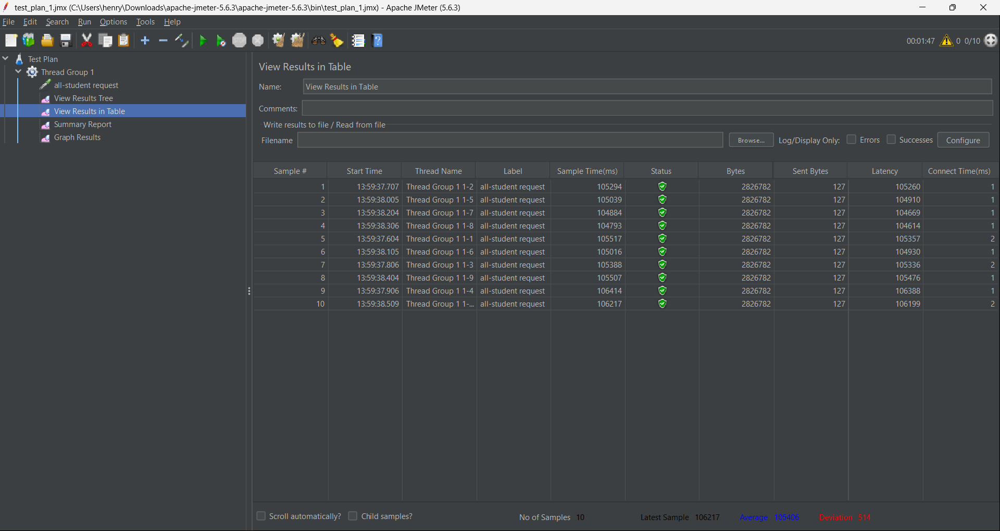
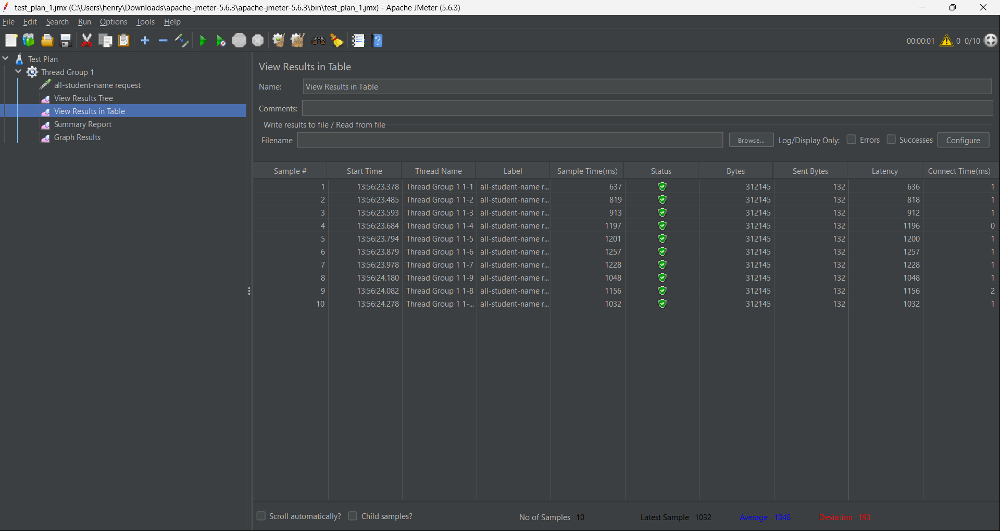
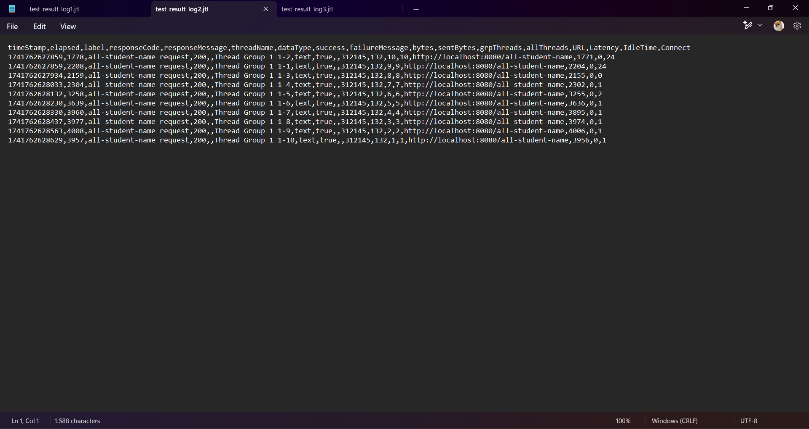

# AdPro Exercise Profiling
**Nama:**   Henry Aditya Kosasi 
**NPM:**    2306214990 
**Kelas:**  AdPro A 
# Navigation List
- [Before Profiling](#before-profiling)

## Before profiling

### JMeter GUI Results Before Profiling
* **all-student**
  
  
* **all-student-name**
  
  
* **highest-gpa**
  
  

### JMeter CMD Results Before Profiling
  
  

## After profiling
* **all-student**
  
* **all-student-name**
  
* **highest-gpa**
  

  
## Reflection
1. What is the difference between the approach of performance testing with JMeter and profiling with IntelliJ Profiler in the context of optimizing application performance? 
   Perbedaan approachnya adalah JMeter fokus pada pengukuran makro (seperti response time, throughput, dan kemampuan app dalam menangani highload). Pada sisi lainnya, Intellij Profiler berfokus pada pengukuran mikro yaitu seperti identifikasi method yang memakan execution time lama, penggunaan memory yang tidak efisien, atau masalah thread contention. Keduanya memiliki peran penting dalam proses optimisasi, dimana mereka dapat saling melengkapi satu sama lainnya. JMeter dapat membantu dalam menemukan masalah performance secara keseluruhan, sedangkan Intellij Profiler membantu solving dalam level kode.
     
   Jika kita hanya menggunakan JMeter, kita bisa mengetahui bahwa aplikasi kita mengalami penurunan performa saat diakses oleh ratusan pengguna secara bersamaan. Namun, JMeter tidak memberi tahu bagian spesifik dari kode mana yang menjadi penyebabnya. Di sinilah IntelliJ Profiler berperan, dengan menjalankan Profiler, kita bisa melihat secara real-time bagaimana aplikasi berperilaku saat dijalankan. Profiler dapat memberikan insight mendetail, seperti metode mana yang paling banyak menghabiskan waktu CPU, atau berapa banyak memori yang dialokasikan.
      
2. How does the profiling process help you in identifying and understanding the weak points in your application?
   Profiler seperti IntelliJ Profiler melacak eksekusi aplikasi dan menunjukkan metode atau fungsi mana yang paling banyak menghabiskan waktu CPU. Ini memungkinkan saya dalam menemukan bagian kode spesifik yang memperlambat aplikasi. Misalnya, jika satu metode menghabiskan 50% waktu eksekusi, jelas bahwa metode tersebut adalah bottleneck yang perlu dioptimasi.
      
3. Do you think IntelliJ Profiler is effective in assisting you to analyze and identify bottlenecks in your application code?
   Ya, IntelliJ Profiler sangat efektif dalam membantu menganalisis dan mengidentifikasi bottleneck dalam kode aplikasi saya. Contohnya yaitu waktu menjalankan all-student yang awalnya sangat lambat, dengan menggunakan IntelliJ Profiler, saya bisa tahu method apa yang membuatnya jadi sangat lambat, yaitu method getAllStudentCourse().
      
4. What are the main challenges you face when conducting performance testing and profiling, and how do you overcome these challenges?
   Performance testing dan profiling membutuhkan waktu yang cukup lama, lalu dibutuhkan ketelitian dalam membaca hasil dari testingnya. Solusinya perlu hati hati dalam mengset up JMeter, lalu sebenarnya bisa batasi jumlah data. Namun, karena saya lumayan banyak waktu, saya biarkan dia run full saja.
      
5. What are the main benefits you gain from using IntelliJ Profiler for profiling your application code?
   IntelliJ Profiler memberikan banyak manfaat dalam proses profiling kode aplikasi, terutama dalam mengidentifikasi dan mengoptimasi performa. Dengan Profiler ini, saya bisa menemukan bottleneck, seperti metode getAllStudentCourse() yang paling banyak menghabiskan waktu CPU, sehingga fokus optimasi menjadi lebih terarah. 
6. How do you handle situations where the results from profiling with IntelliJ Profiler are not entirely consistent with findings from performance testing using JMeter?
   Saya belum pernah mengalami situasi ini, jadi saya kurang tahu pasti bagaimana mengatasinya. Namun, jika menghadapi masalah ini, saya mungkin akan mencoba memverifikasi ulang skenario pengujian di kedua alat tersebut dan mencari tahu faktor-faktor yang bisa menyebabkan perbedaan hasil. Bisa jadi ada perbedaan antara pengujian dalam lingkungan lokal (profiling) dan pengujian dengan beban nyata (JMeter) yang perlu dianalisis lebih lanjut.
      
7. What strategies do you implement in optimizing application code after analyzing results from performance testing and profiling? How do you ensure the changes you make do not affect the application's functionality?
   Setelah menganalisis hasil dari profiling di IntelliJ dan load testing dengan JMeter, langkah pertama dalam optimasi kode adalah mengidentifikasi bottleneck utama, seperti metode yang paling banyak mengonsumsi CPU. Jika profiler di IntelliJ menunjukkan adanya metode yang terlalu sering dipanggil atau menggunakan CPU secara tidak efisien, maka lakukan refactoring kode dengan algoritma yang lebih optimal.
      
  Agar optimasi ini tidak merusak fungsionalitas aplikasi, saya menjalankan ulang JMeter untuk membandingkan hasil sebelum dan sesudah optimasi.